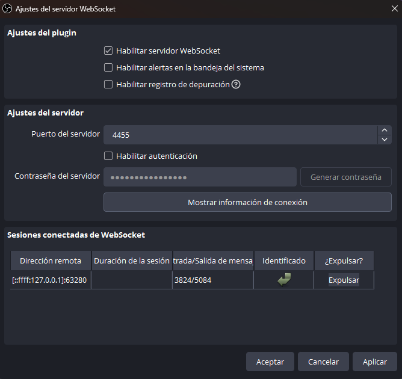

# 🎥 StreamAvatarAI — Avatar inteligente para streaming con OBS + Ollama + Fish Audio

Este repositorio contiene un sistema completo que permite crear un **avatar inteligente** que:

✨ *Observa tu stream en tiempo real*
🧠 *Analiza lo que ocurre usando un modelo de lenguaje*
🎙️ *Habla con una voz TTS personalizada (Fish Audio)*
🎮 *Reacciona como un streamer humano, con humor y estilo*

El sistema se ejecuta dentro de un entorno Docker y utiliza:

- **OBS WebSocket** para obtener frames del stream.
- **Ollama** para ejecutar un modelo LLM local.
- **Fish Audio** para generar voz en tiempo real.
- **Un watcher en PowerShell** que reproduce los audios generados.

## 📚 Documentación

Antes de comenzar, leer:

- [`docs/00_setup.md`](docs/00_setup.md) — *Guía completa de instalación*
- [`docs/01_config.md`](docs/01_config.md) — *Detalles de configuración del sistema*

## 🚀 Flujo general del sistema

1. OBS captura un frame del stream.
2. El pipeline analiza cada ciclo controlado por tiempo.
3. Cuando corresponde, se envía el frame al LLM (Ollama).
4. El LLM genera una reacción corta basada en lo que ve.
5. El texto se envía al TTS (Fish Audio).
6. El TTS genera un archivo `.mp3`.
7. Un watcher en Windows detecta ese archivo y lo reproduce.
8. OBS captura ese audio y lo mezcla en la transmisión.

Todo automatizado.

## 🔧 Variables de entorno necesarias

El proyecto requiere estas variables (gestionadas vía `.env`):

| Variable          | Ejemplo                   | Descripción                               |
| -- | - | -- |
| `OBS_PORT`        | `4455`                    | Puerto del WebSocket de OBS.              |
| `OBS_PASSWORD`    | `""` o `"tu_password"`    | Contraseña del WebSocket (opcional).      |
| `APP_PORT`        | `8000`                    | Puerto de la app (si aplica).             |
| `APP_CONFIG_PATH` | `"/app/config.yaml"`      | Ruta interna al archivo de configuración. |
| `OLLAMA_URL`      | `http://ollama:11434`     | Endpoint del servicio Ollama.             |
| `FISH_API_KEY`    | `123d45s6a48dsadxzaaaxxx` | API key de Fish Audio para el TTS.        |

## 🔌 Cómo obtener los valores

### Puertos y contraseña de OBS

Abrir OBS → Ajustes → WebSocket Server.



### API Key de Fish Audio

Ir a:

```bash
https://fish.audio/es/app/api-keys/
```

Crear una nueva API Key y colocarla en `.env`.

## 🏁 Arranque rápido

Ejecutar todo en este orden:

```bash
ipconfig > path.log
./scripts/shell/docker/build.sh
./scripts/shell/docker/start.sh
./scripts/shell/ollama/install-model.sh qwen2.5vl:7b
./scripts/shell/docker/shell.sh obs
```

Dentro del contenedor:

```bash
python main.py
```

En una terminal de Windows:

```powershell
powershell -ExecutionPolicy Bypass -File .\scripts\powershell\play-tts-watcher.ps1
```

## 🎛️ Configurar OBS para capturar el TTS

En OBS:

1. Agregar **Captura de audio de aplicación (Beta)**.
2. Elegir el dispositivo que reproduce el audio generado (por ejemplo *Media Player (exe)*).

## 🧩 Personalización recomendada

### 🔊 TTS

Cambia la voz en:

```bash
tts.voice_id
```

Puedes obtener IDs desde las páginas de voces, ejemplo:

```bash
https://fish.audio/es/app/m/<voice-id>/
```

El ID es el final de la URL.

### 🤖 Modelo LLM

Cambiar:

```bash
llm.model_name
llm.prompt_base
```

Si tienes hardware potente, puedes usar modelos mayores.

### ⚙️ Frecuencia de habla, historial y ciclos

En `app`:

- `frames_per_cycle`
- `capture_interval_seconds`
- `max_history_messages`
- `min_speak_cycles`
- `max_speak_cycles`

Controlan cuántos frames se capturan, cuánto dura cada ciclo y cada cuánto habla el avatar.

## 🧰 Notas adicionales

### Problemas con autenticación Docker

Si Docker presenta errores con login o pulls:

Verificar archivo:

```bash
cat ~/.docker/config.json
```

Debe contener:

```json
{}
```

Luego crear un token en Docker Hub y hacer login:

```bash
docker login <usuario>
```
